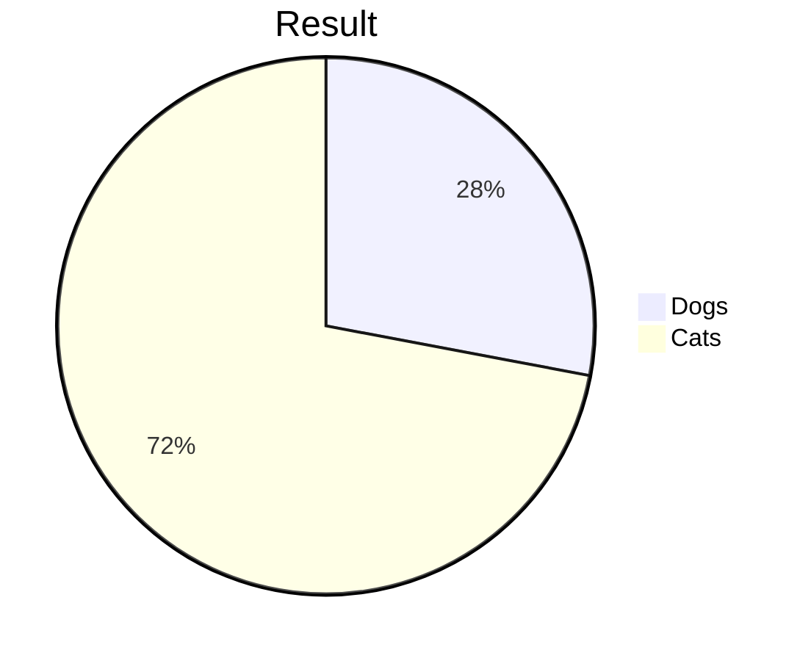
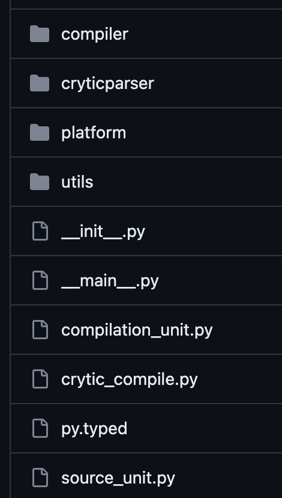
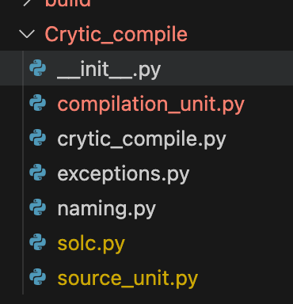

# 2023.10.23 (월)

### solc-parser에서 버그 발견

```python
def get_highest_version(self, version_list, target_version, target_index):
    matching_versions = []
    target_major_minor = '.'.join(target_version.split('.')[:2])
    for v in version_list:
        if v.startswith(target_major_minor):
            matching_versions.append(v)
    else:
        return matching_versions[target_index -1]
```

- 기존에는 최신 버전순으로 리스트가 만들어져, 기호에 따라 더 높은 버전을 선택해야 한다면 리스트의 앞 index를 선택하도록 되어있음

  - 잘못 생각했던 부분: ~0.7.6 이면 0.8.0을 골라야 하는 줄 알았음. 생각해보면 0.4버전을 0.8로 실행할 수는 없음. 0.7.6 처럼 마이너 버전의 가장 높은 패치 버전일 경우 그 버전 그대로 선택해야 함. 0.8.0 으로 넘어가면 컴파일이 안됨

- Solution
  ```python
  def get_highest_version(self, version_list, target_version, target_index):
      matching_versions = []
      target_major_minor = '.'.join(target_version.split('.')[:2])
      for v in version_list:
          if v.startswith(target_major_minor):
              matching_versions.append(v)
      if target_version == matching_versions[0]:
          return version_list[target_index]
      else:
          return matching_versions[target_index -1]
  ```

### SolcParser class 생성

- 기존에 함수 형태로 주어지던 solc-parser를 class로 만들어 한번에 버전 파싱 부터 버전에 맞는 solc 바이너리 설치까지 연결되도록 구성함

```text
💡 깨달은 점
하나로 묶을 수 있을 것 같다고 무조건 묶지 말자! 어떠한 행동을 하는 함수는 따로 빼두는게 다른 곳에서 쓰기도 편하다.. 클래스로 묶어두니까 쓸 때마다 인스턴스 생성해야 돼서 불편. Crytic Compile 중에 CompileVersion에 대한 내용이 그러했음
```

### markdown mermaid 그래프 그리기

- markdown으로 그래프 그리려면 mermaid 사용해야 함
- VSCode Extension 중에 mermaid viewer 설치해야 그래프 볼 수 있음(아니면 코드블럭으로 출력됨)



- 근데 그래프를 나란히 둘 수는 없는 것 같음(방법 찾아보기)

<br></br>

# 2023.10.24 (화)

- 자체적으로 컴파일 되는 방식 구현

  ```python
    from pathlib import Path
    from typing import Any, Dict, List, Optional, Union
    from semantic_version import Version
    from parse_version_and_install_solc import SolcParser
    from exceptions import *
    import sys
    import json
    import subprocess

    def execute_solc(source: str, solc_binary_path: Union[Path, str] = None, solc_version: Union[Version, str] = None):
        solc_binary_path = solc_binary_path.joinpath(f"solc-{solc_version}")
        command: List = [str(solc_binary_path)]

        if isinstance(source, (str, Path)):
            command.append(source)
        option = ["--combined-json", "abi,ast,bin,bin-runtime,srcmap,srcmap-runtime,userdoc,devdoc,hashes", "--allow-paths", "."]
        command.extend(option)

        proc = subprocess.Popen(
            command,
            stdin=subprocess.PIPE,
            stdout=subprocess.PIPE,
            stderr=subprocess.PIPE,
            encoding="utf8",
        )

        stdout, stderr = proc.communicate()

        if stderr:
            print("solc stderr:\n%s", stderr)
        try:
            ret: Dict = json.loads(stdout)
            return ret
        except json.decoder.JSONDecodeError:
            raise InvalidCompilation(f"Invalid solc compilation {stderr}")

    def main():
        instance = SolcParser(sys.argv[1])
        solidity_file = instance.source
        solc_version = instance.solc_version
        solc_binary_path = instance.solc_binary_path
        ret = execute_solc(solidity_file, solc_binary_path, solc_version)
        open("ast.json", "w").write(json.dumps(ret, indent=2))

    if __name__ == "__main__":
        main()
  ```

- slither, crytic-compile repo 붙이기

<br></br>

# 2023.10.25 (수)

### slither wrapping

- slither에서 detector 돌리기 전에 거치는 과정 : Slither -> CryticCompile -> CompilationUnit -> SourceUnit
  - 이때, 버전에 대한 자동화 부분이 존재하지 않음
  - 돌릴때 마다 사용자가 설정해야 하는 문제 발생
  - 만약, 디렉토리 경로를 주고 안에 있는 sol 파일 버전들이 모두 다르다면 돌아가지 않음
- SafeDevAnalyzer wrapping 하여 버전 자동화 및 deploy를 위해 필요한 정보(abi, evm bytecode)를 뽑아내는 클래스 생성

<br></br>

### Compile 방식 변경

- 만들기 전에 생각한 것은 sol 파일의 버전 파싱해서 기호에 따른 적절한 solc 바이너리 설치하고 적용후 해당 버전의 solc 바이너리를 실행하여 컴파일하는 방식으로 가면 되겠다 생각함
- 기존에 slither에서 수행하는 컴파일 방식에서는 CryticCompile object를 결괏값으로 출력하고 있어 우리가 원하는 정보들 뽑기가 어렵다 판단
- solc-parser에 solc 실행하는 것까지 내가 만들고, 거기서 ABI, bytecode를 뽑아낸 다음에 crytic-compile에서 컴파일하는 함수만 덮어씌워주면 되지 않을까? 생각했음
  ```mermaid
    %%{init: {"flowchart": {"htmlLabels": false}} }%%
    flowchart LR
        markdown["`solc compile`"]
        newLines["`ABI
        EVM bytecode
        CryticCompile object`"]
        markdown --> newLines
  ```
- Crytic Compile 내 solc platform 로직을 수정하면 될 것이라 생각했는데, 종속성이 심해서 변경이 불가하였음
- 드림아카데미때 만들었던 Join에서 SolcParser 상속 받아 사용하는 형태로 로직 변경함.
- 반대로 Crytic Compile에서 abi, bytecode를 뽑아내도로 테스트함

  ```python
    instance = SafeDevAnalyzer('/Users/sikk/Desktop/AntiBug/development/SafeDevAnalyzer/antibug/compile/test/overflow.sol')
    file= '/Users/sikk/Desktop/AntiBug/development/SafeDevAnalyzer/antibug/compile/test/overflow.sol'
    object=Filename(absolute='/Users/sikk/Desktop/AntiBug/development/SafeDevAnalyzer/antibug/compile/test/overflow.sol', used='/Users/sikk/Desktop/AntiBug/development/SafeDevAnalyzer/antibug/compile/test/overflow.sol', relative='test/overflow.sol', short='test/overflow.sol')
    abis =instance.crytic_compile[0]._compilation_units[file]._source_units[object].abis
    runtime_bytecodes = instance.crytic_compile[0]._compilation_units[file]._source_units[object]._runtime_bytecodes

    combined_data = {
        "abis": abis,
        "bytecodes": runtime_bytecodes
    }

    combined_json = json.dumps(combined_data, indent=4)
    print("abi and bytecode")
    print(combined_json)
    print()

    print("compilation units")
    print(instance.crytic_compile[0])

    ###### test directory #######  -> done
    instance1 = SafeDevAnalyzer('/Users/sikk/Desktop/AntiBug/development/SafeDevAnalyzer/antibug/compile/test/overflow.sol')
    print(instance1.compilation_units)

    ###### test zip ######### -> not working
    instance2 = SafeDevAnalyzer('/Users/sikk/Desktop/AntiBug/development/SafeDevAnalyzer/antibug/compile/test.zip')
    print(instance2.compilation_units)

    ###### test import #########
    instance3 = SafeDevAnalyzer('/Users/sikk/Desktop/AntiBug/development/SafeDevAnalyzer/antibug/compile/test/import/var.sol')
    print(instance3.compilation_units)

    instance4 = SafeDevAnalyzer('/Users/sikk/Desktop/AntiBug/development/SafeDevAnalyzer/antibug/compile/test/import')
    print(instance4.compilation_units)
  ```

  -> 원하는 3개의 값을 잘 뽑아냄

<br></br>

### JSON으로 output 저장하기

- 뽑아낸 abi, bytecode에 대해 JSON output을 만들어야 하고, crytic-compile object는 slither로 넘겨주는 과정이 필요함
- main 파일 생성하여 로직 구현

  ```python
  def get_root_dir():
      current_path = os.path.dirname(os.path.abspath(os.path.dirname(__file__)))
      return current_path

  def convert_to_deploy_info_json(abi_list, bytecode_list, analyzer:SafeDevAnalyzer):
      combined_data = {}
      output_dir = os.path.join(get_root_dir(), "result/deploy_info_json_results")
      print(f"Output directory: {output_dir}")

      files = glob.glob(os.path.join(output_dir, "*"))
      for f in files:
          try:
              os.remove(f)
          except Exception as e:
              print(f"Failed to delete {f}. Reason: {e}")

      if not os.path.exists(output_dir):
          os.makedirs(output_dir)

      for abi, bytecode, filename in zip(abi_list, bytecode_list, analyzer.target_list):
          filename=os.path.basename(filename)[:-4]
          key = next(iter(abi))
          combined_data[key] = {
              "contract": key,
              "abis": abi[key],
              "bytecodes": "0x" + bytecode[key]
          }
          combined_json = json.dumps(combined_data[key], indent=2)
          try:
              output_path = os.path.join(output_dir+f"/{filename}.json")
              with open(output_path, "w") as f:
                  f.write(combined_json)
          except Exception as e:
              print(f"Failed to write to {output_path}. Reason: {e}")
  ```

  -> 10/26일에 짜둔 완성본이긴 함..ㅎㅎ

<br></br>

# 2023.10.26 (목)

### SafeDevAnalyzer 폴더 밖에서 sol 파일을 target으로 주면 deploy 결과를 받아올 수 없는 문제 발생

- 기존 코드

  ```python
    def get_root_dir():
        current_working_directory = os.getcwd()
        while not os.path.basename(current_working_directory) == "safe_dev_analyzer":
            current_working_directory = os.path.dirname(current_working_directory)
        return current_working_directory
  ```

  - 디렉토리명을 대문자로 두고, 파일 이름과 디렉토리 이름이 같을 경우 not a package? 그런 에러가 출력됨
  - 그래서 SafeDevAnalyzer를 safe_dev_analyzer로 설정하고 해당 디렉토리를 찾고자 했음
  - get_root_dir 로직 때문에 SafeDevAnalyzer 폴더 밖에서 sol 파일을 target으로 주면 deploy 결과를 받아올 수 없는 문제 발생했음
    ```shell
        $ antibug deploy [target]
    ```

- Solution
  ```python
  def get_root_dir():
      current_path = os.path.dirname(os.path.abspath(os.path.dirname(__file__)))
      return current_path
  ```

<br></br>

### blacklist 기반 detector 붙이기

- slither-simil에 있는 기능 수정하여 lending 관련 취약점 코드를 모아둔 `SafeDevAnalyzer/antibug/run_detectors/based_blacklist/lending` 기반으로 코드 유사도 돌리는 기능 추가
- encode.py에 있는 Slither 클래스 대신 우리가 만들어둔 SafeDevAnalyzer wrapping

  ```python
  def encode_ir(ir):
      ...
    if isinstance(ir, Index):
        return f"index({ntype(ir.variable_left.type)})"

  ```

- 기존에는 Slither 클래스를 호출하고 있어 contract에 바로 접근할 수 있었으나, SafeDevAnalyzer 클래스를 호출할 경우 compilation_unit부터 시작해 contract까지 접근하도록 로직 변경이 필요함

  ```python
  def encode_contract(cfilename, **kwargs):
      r = {}

      # Init slither
      try:
          slither = SafeDevAnalyzer(cfilename, **kwargs)
      except Exception:  # pylint: disable=broad-except
          simil_logger.error("Compilation failed for %s using %s", cfilename, kwargs["solc"])
          return r

      # Iterate over all the contracts
      for compilation_unit in slither.compilation_units.values():
          for contract in compilation_unit.contracts:
              for function in contract.functions_declared:
                  if function.nodes == [] or function.is_constructor_variables:
                      continue

                  x = (cfilename, contract.name, function.name)

                  r[x] = []

                  # Iterate over the nodes of the function
                  for node in function.nodes:
                      # Print the Solidity expression of the nodes
                      # And the SlithIR operations
                      if node.expression:
                          for ir in node.irs:
                              r[x].append(encode_ir(ir))
      return r
  ```

  <br></br>

### deploy, detector(basic, blacklist) output JSON으로 뽑아내기

- result 폴더 내 `deploy_info_json_results`, `basic_detector_json_results`, `blacklist_json_results` 하위에 위치하도록 설정
- `__main__.py` 내에 로직 수정 -> 리팩토링 필요(다른 파일로 빼는게 좋을 것 같음요)

<br></br>

# 2023.10.28 (토)

### Crytic Compile core 코드만 남기기

- 드림아카데미때는 slither 통째로 가져오고 Crytic Compile, solc-select을 pip로 설치 후에 사용해야 했음(setup.py에 정의해서)
- VSC Extension에 들어갈 코드들이 너무 무거워질 것 같다는 판단 -> core 만 남기자!
- 기존 Crytic Compile tree
  
- 종속성 고려하면서 남긴 코어들
  <tr></tr>

  

<br></br>

# 2023.10.29 (일)

### 버전 매칭 관련 버그 해결

- 0.8, 0.7 버전은 잘돌아갔으나, 0.5 버전에 대해 제대로 out of index 에러 발생
- target_index 값이 matching_versions 인덱스로 받아와야 하나, 전체 버전 리스트에서의 인덱스를 받아와서 부버전이 일치하는 버전 리스트에서 해당 인덱스에 접근하고자 하여 에러가 발생했음
- 기존 코드

  ```python
    def get_highest_version(self, version_list, target_version, target_index):
        matching_versions = []
        target_major_minor = '.'.join(target_version.split('.')[:2])
        for v in version_list:
            if v.startswith(target_major_minor):
                matching_versions.append(v)
        if target_version == matching_versions[0]:
            return version_list[target_index]
        else:
            return matching_versions[target_index -1]
  ```

- Solution
  ```python
    def get_highest_version(self, version_list, target_version, target_index):
        matching_versions = []
        target_major_minor = '.'.join(target_version.split('.')[:2])
        for v in version_list:
            if v.startswith(target_major_minor):
                matching_versions.append(v)
        target_index = matching_versions.index(target_version)

        if target_version == matching_versions[0]:
            return matching_versions[target_index]
        else:
            return matching_versions[target_index -1]
  ```
  - matching_versions 내에서 target_version의 인덱스를 구하고, 해당 리스트 내에서 적절한 버전을 선택하도록 로직 변경
  - 그전에는 부버전 중 가장 최신일 경우 다음 부버전으로 넘어간다고 생각해서 version_list에서 인덱스를 검색했으나, 부버전 내에서만 선택해야 하므로 matching_versions만 고려하면 됨

<br></br>

### Crytic Compile 관련 core만 남기기

- crytic compile 관련하여 core 로직만 남기고 삭제함
- 현재 sol 파일이 import 하는 것에 대해서는 고려하지 않은 상태라 library 관련 메소드들은 살려둔 상태임

<br></br>

### sol 파일 내부에 컨트랙트가 여러 개 있을 때 가장 마지막 컨트랙트에 대한 abi, bytecode가 생성되는 문제 해결
- 단일 sol 파일에 여러 컨트랙트가 들어가는걸 고려 못했음
- key를 가장 처음 나오는 컨트랙트 명으로 한정지어버려서(`next(iter(abi))`) 가장 처음 컨트랙트에 대해서만 abi, bytecode가 추출되었음
  
- 기존 코드
  ```python
    for abi, bytecode, filename in zip(abi_list, bytecode_list, analyzer.target_list):
      filename=os.path.basename(filename)[:-4]
      key = next(iter(abi))
      combined_data[key] = {
          "contract": key,
          "abis": abi[key],
          "bytecodes": "0x" + bytecode[key]
      }
      combined_json = json.dumps(combined_data[key], indent=2)
      try:
          output_path = os.path.join(output_dir+f"/{filename}.json")
          with open(output_path, "w") as f:
              f.write(combined_json)
      except Exception as e:
          print(f"Failed to write to {output_path}. Reason: {e}")
  ```

- Solution
  ```python
    combined_json = {}
      for (contract, abi_data), bytecode in zip(abi_list[0].items(), bytecode_list[0].values()):
          combined_data[contract]= {
              "abis": abi_data,
              "bytecodes": "0x" + bytecode
          }
          combined_json=combined_data
      result_json = json.dumps(combined_json, indent=2)   
      filename=os.path.basename(analyzer.target_list[0])[:-4]
  ```
  - 기존에는 디렉토리로 path가 들어올 것을 고려해서 abi, bytecode, filename을 모두 list로 받음
  - 지금 당장 list 형태를 단일로 바꾸기에는 일이 커질 것 같아서 0번째 인덱스라고 하드코딩 해놨음..
  - output에서 달라진 점은 
    ```JSON
      {
        "contract": "EtherStore",
        "abi": "~~~",
        "bytecodes": "0x~~~~"
      }
    ```
    형태에서
    ```JSON
      {
        "EtherStore" {
          "abi": "~~~",
          "bytecodes": "0x~~~~"
        }
      }
    ```
    로 변경됨. "contract": "EtherStore" 형태로 남길 수 있었으면 좋았을 텐데 컨트랙트 마다 반복문을 돌려서 json 값을 업데이트 해줘야 해서 컨트랙트 이름이 2번 나오는 output이 만들어졌음.
    extension 쪽에서 `Object keys` 함수로 접근할 수 있다고 해서 일단 저렇게 만들어놨음

<br></br>

# TODOs

- [ ] openzepplin import 시 compile이 되지 않는 문제 -> flat으로 해결?

- 해결책 모색 필요함
  <br></br>

- [ ] OPCODE로 코드 가스비 알아내기

- json_result로 보여줄 수 있게
  <br></br>

- [ ] json_result path 바꿀 수 있는 옵션 제공하기

- 현재는 SafeDevAnalyzer/json_result로 생성됨
- [ ] detector basic 돌렸을 때 filename, contract, function 추출 시 인덱스 번호가 달라서 추출되지 않는 파일도 존재함

  - test/reentrancy.sol 기준으로 정해둔거라 일반화된 수정 필요함

- [x] sol 파일 내부에 컨트랙트가 여러 개 있을 때 가장 마지막 컨트랙트에 대한 abi, bytecode가 생성되는 문제 해결하기

- [ ] JSON output 뽑아내는 코드 `__main__.py`에서 분리하기

- [ ] mermaid 그래프 나란히 두는 방법 찾아보기
