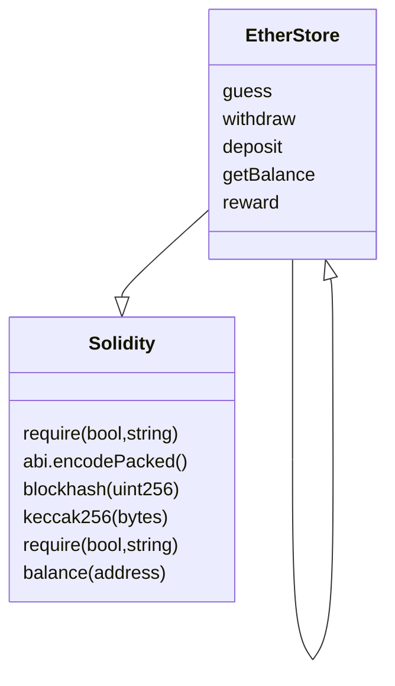

```mermaid
classDiagram
	class EtherStore{
		guess
		withdraw
		deposit
		getBalance
		reward
	}
	class Solidity{
		require(bool,string)
		abi.encodePacked()
		blockhash(uint256)
		keccak256(bytes)
		require(bool,string)
		balance(address)
	}
EtherStore --|> Solidity
EtherStore --|> EtherStore
```