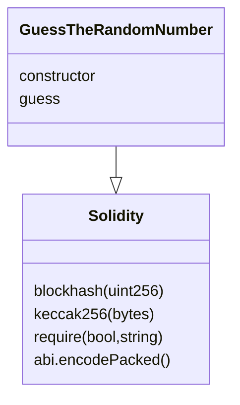

```mermaid
classDiagram
	class GuessTheRandomNumber{
		constructor
		guess
	}
	class Solidity{
		blockhash(uint256)
		keccak256(bytes)
		require(bool,string)
		abi.encodePacked()
	}
GuessTheRandomNumber --|> Solidity

```