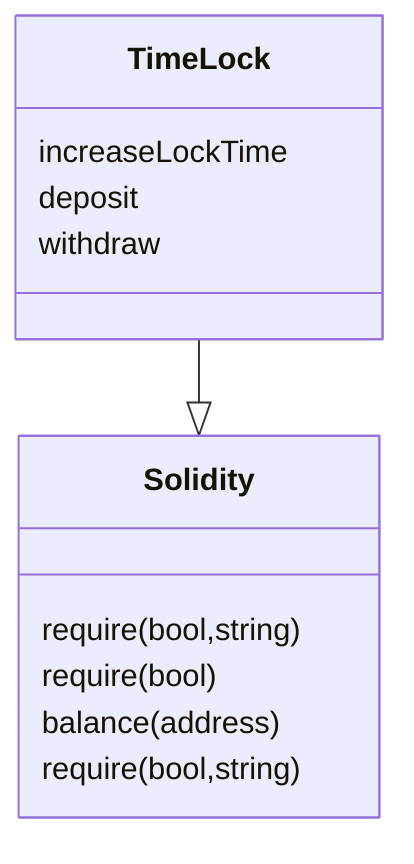

```mermaid
classDiagram
	class TimeLock{
		increaseLockTime
		deposit
		withdraw
	}
	class Solidity{
		require(bool,string)
		require(bool)
		balance(address)
		require(bool,string)
	}
TimeLock --|> Solidity

```